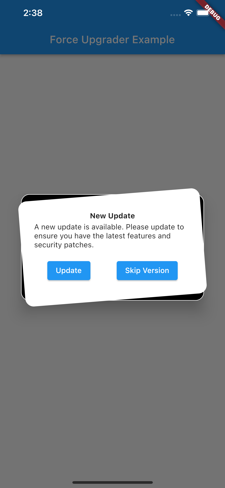

# Force Upgrader

An un-opinionated upgrader to prompt users to upgrade their app with callbacks to allow deep customization

## UI
The default dialog tries to be platform agnostic fitting on multiple platforms. However this dialog
like everything else can be easily replaced

## Usage
Insert the `ForceUpgrader` widget anywhere in your widget tree but preferably somewhere high up
```dart
import 'package:flutter/material.dart';
import 'package:force_upgrader/force_upgrader.dart';

void main() {
  runApp(const MyApp());
}

class MyApp extends StatelessWidget {
  const MyApp({Key? key}) : super(key: key);
  @override
  Widget build(BuildContext context) {
    return MaterialApp(
      title: 'Force Upgrader Example',
      theme: ThemeData(
        primarySwatch: Colors.blue,
      ),
      home: const ExampleHome(),
    );
  }
}

class ExampleHome extends StatelessWidget {
  const ExampleHome({Key? key}) : super(key: key);

  @override
  Widget build(BuildContext context) {
    return ForceUpgrader(
      getMinimumVersion: () async => '2.0.0',
      allowSkipCallback: () async => true,
      onDialogDismissed: () {
        debugPrint("Skipped");
      },
      child: Scaffold(
        appBar: AppBar(
          title: const Text('Force Upgrader Example'),
        ),
      ),
    );
  }
}
```

Force Upgrader's constructor takes the following parameters
* child: The child to return under Force Upgrader
* upgradeDialog: An optional custom dialog
* getMinimumVersion: The future callback to get the minimum version string
* getCurrentVersion: The optional future callback to call to get the current version string
* androidPackageName: The optional Android package name of the flutter app
* iOSAppStoreId: The optional iOS AppStore Id of the flutter app
* macOSAppStoreId: The optional macOSAppStoreId of the flutter app
* windowsStoreId: The optional windowsStoreId of the the flutter app
* defaultStoreUrl: The optional upgrade url of the flutter app
* dialogHeadingText: Custom optional heading text for the upgrade dialog
* dialogBodyText: Custom optional body text for the upgrade dialog
* updateButtonText: Custom optional text for the upgrade dialog's update button
* allowSkipCallback: The future callback to call to determine if skipping is allowed
* skipButtonText: Custom optional text for the upgrade dialog's skip button
* onDialogDismissed: The optional callback to call when upgrade dialog's skip button is pressed

## Version Strings
Version strings must be in compliance with the Semantic Versioning Spec (https://semver.org/)